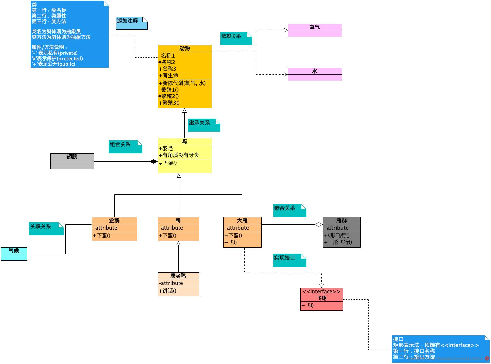
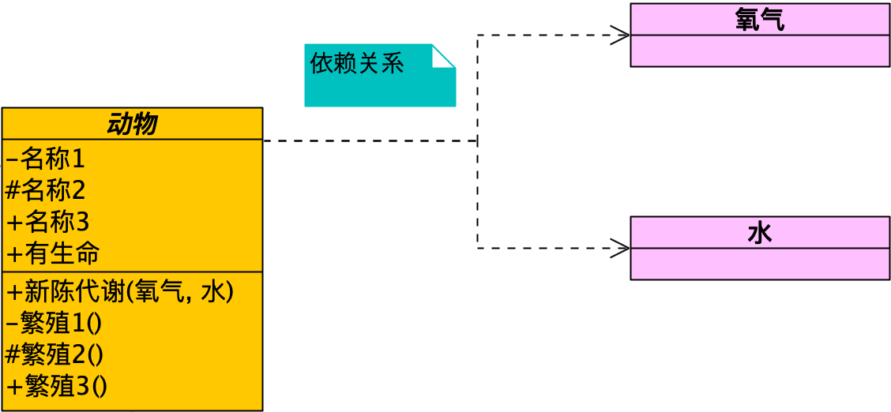
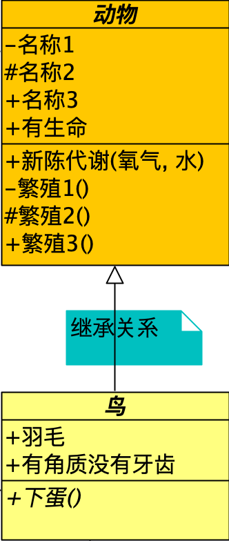
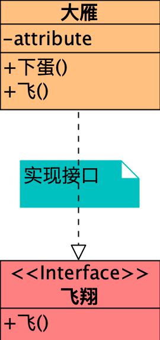
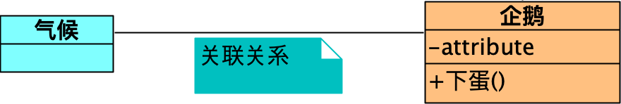
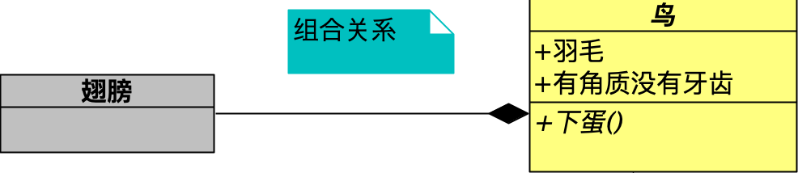
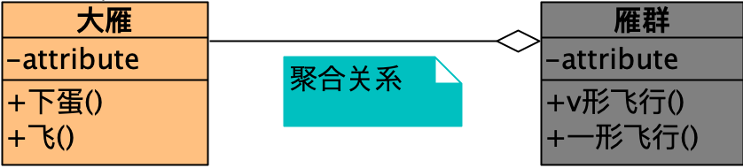
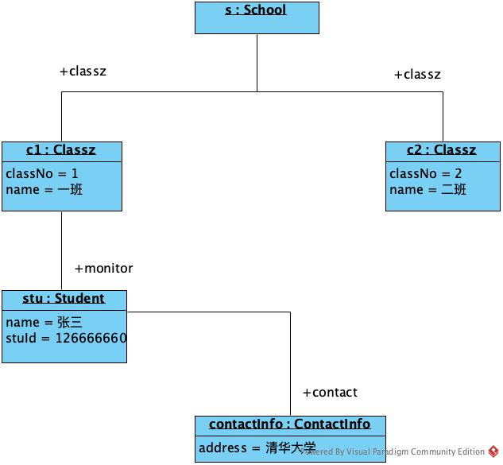

# UML 图总结
## UML 类图
> 描述类、接口、协作及他们之间的关系的图。显示系统中类的静态结构。

### 有什么作用？
描述软件系统的静态结构
- 对系统的词汇建模
- 对简单协作建模
- 对逻辑数据库模式建模

### 类图说明
> 类名为斜体则为抽象类 类方法为斜体则为抽象方法  第一行：类名称 第二行：类属性 第三行：类方法  类/属性/方法说明：  '-' 表示私有(private)  '#'表示保护(protected) '+'表示公开(public)

### 依赖关系
> `虚线箭头`表示。

### 继承关系
> `实线空心三角形箭头`表示。

### 实现关系
> `虚线空心三角形箭头`表示。

### 关联关系
> `实线`表示。

### 组合关系
> `实线黑色菱形箭头`表示。

### 聚合关系
> `实线空心菱形箭头`表示。

## UML 对象图
> 显示了某一时刻的一组对象及它们之间的关系。对象图可被看作是类图的实例,用来表达各个对象在某一时刻的状态。

### 对象图说明
> stu 实例名称，Student 所属类。 第一行：对象名称 第二行：实例属性具体值

- stu:Student 标准表示法
- :Student 匿名表示法
- stu 省略类名表示法